# Building a Provenance-Tracked Hybrid of Classical OCR and a Vision-Language Model for a Year of *The Daily Colonist*

**Corey Davis, University of Victoria Libraries** DRAFT Thu Jul 30 2026

## Abstract

Without accurate OCR, a digitized historical newspaper is an unsearchable picture of text. This article describes a two-phase experiment at the University of Victoria Libraries that rebuilt full-text search for a complete year of *The Daily Colonist* (1925: 312 issues, 6,647 pages, roughly 27 million words) by combining two OCR (optical character recognition) engines with different outputs: Tesseract 5, which supplies precise word-level geometry and confidence but silently drops large regions of degraded microfilm scans, and PaddleOCR-VL, a vision-language model that transcribes far more accurately but reports no confidence and only block-level position. The hybrid system maps the VLM's text onto Tesseract's coordinates, resolves disagreements through an explicit rule cascade, and records a provenance class for every word, so each token in the index can report which engine produced it, how its position was derived, and how any disagreement was resolved. Four generations of OCR were evaluated on identical scans, and the hybrid consistently outperformed the others: for example, the query *railway* returns 2,636 pages against 1,818 for the collection's existing commercial layer and 731 for Tesseract alone. This article reports the construction in full: the provenance architecture that makes the index auditable rather than merely better; an arbitration study that was built, evaluated, and discarded due to model unreliability; a previously undescribed structural error mode in the commercial ABBYY layer; a no-ground-truth evaluation methodology built on instrumented, page-verified spot checks; and a sustainability analysis at 150-year scale. The development process, conducted with AI assistance under a verify-before-acting protocol, is also documented. Code, configuration, and the full development record are available openly.

## 1. The Role of Search in Digital Collections

[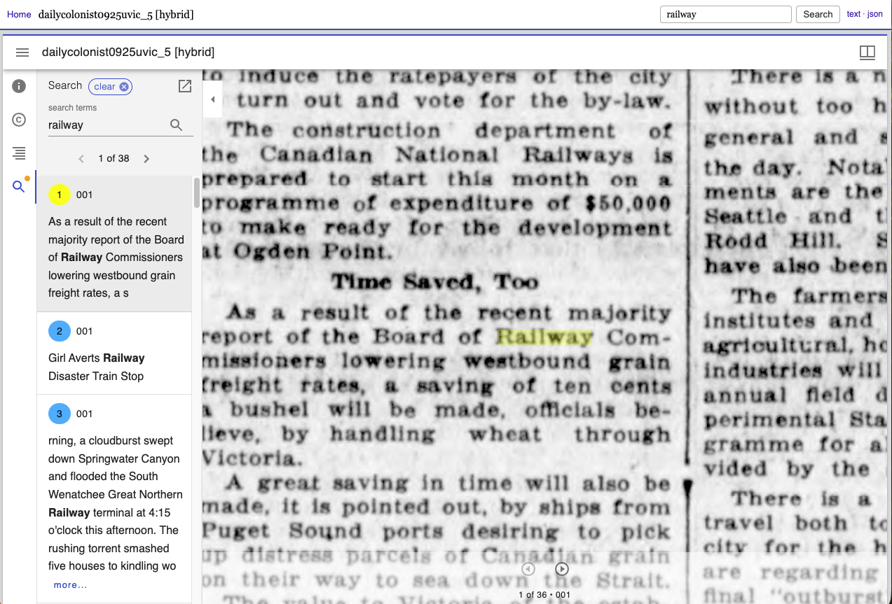](images/figure-1.png)

**Figure 1:** Hybrid search interface showing a query for *railway*. Selecting a result opens the corresponding newspaper page and highlights the matching word at its location in the scan.

For digitized historical collections, OCR quality largely determines what users can discover through full-text search. Text omitted during extraction cannot be retrieved, while errors in names, addresses, dates, and other key terms can hide otherwise relevant pages. In practice, what the OCR fails to capture, the search system cannot find.

Many digitization programs have begun reprocessing older OCR for this reason. In 2025, the Library of Congress announced that it would reprocess more than 23 million historic newspaper pages in *Chronicling America*, concluding that OCR created roughly fifteen years earlier no longer met the needs of contemporary users (Library of Congress 2025). Every large newspaper digitization program faces the same situation: Trove, Europeana Newspapers, and the British Newspaper Archive all carry text layers created with the best tools available at digitization time, layers that have determined what users can and cannot find ever since (Holley 2009; Neudecker and Antonacopoulos 2016).

The University of Victoria Libraries holds *The Daily Colonist* (Victoria, B.C., 1858–1980), digitized from microfilm and hosted on the Internet Archive, where an ABBYY FineReader pass from roughly 2015 provides the search layer. The complete 1925 run (312 issues comprising 6,647 pages) was selected as a testbed for a question now facing many collection stewards: what would it take to reprocess a heritage newspaper collection with modern tools, and would the resulting gains in access justify the investment?

The answer settled on in thos project is not to simply run a better OCR engine, but rather to to merge the outputs of two systems whose failures are complementary, link their results word by word, and track the origin of every token so the resulting index can show its work. This article describes both phases of that work, the comparison testbed (Phase 1) and the hybrid construction (Phase 2), with the rationale for each design decision, the evaluation strategy used in the absence of ground truth, the things that failed, and the costs of doing this at 150-year scale.

### 1.1 Related work

**OCR as scholarly infrastructure.** OCR quality shapes what can be found and studied in digitized historical collections. Its effects are well documented: recognition errors propagate through search into subsequent research tasks and downstream text analysis (Traub, van Ossenbruggen, and Hardman 2015; Chiron et al. 2017a; Hill and Hengchen 2019; van Strien et al. 2020). As Cordell (2017) argues, an OCR text is effectively a new edition with its own bibliographic life, deserving critical scrutiny rather than silent trust. This project adopts that perspective by recording how every indexed word was produced through a provenance architecture that makes the construction of the searchable text transparent. More broadly, the field has responded with reprocessing frameworks (Neudecker et al. 2019; Neudecker and Antonacopoulos 2016), enrichment platforms that treat newspapers as research data (Ehrmann et al. 2020; Ahnert et al. 2023), and crowdsourced or automated correction at national scale (Holley 2010; Evershed and Fitch 2014).

**Multi-engine recognition.** Combining multiple recognition outputs is an established approach, traditionally implemented through text voting. Early work used consensus-sequence voting (Lopresti and Zhou 1997), followed by full-system alignment methods (Lund and Ringger 2009); the ROVER algorithm applied similar ideas to speech recognition (Fiscus 1997), while modern OCR systems increasingly incorporate cross-model voting within the recognizer itself (Wick, Reul, and Puppe 2020). The hybrid described here builds on this lineage but does not attempt to select a single "best" reading. Instead, it combines the strengths of two complementary systems asymmetrically: one provides the text, the other the word geometry and confidence estimates, while unresolvable disagreements are indexed under both readings rather than forced to a single winner. Unlike earlier fusion approaches, every indexed token carries a provenance record identifying both the recognition path responsible for its text and the method by which its word-level geometry was obtained.

**Post-OCR correction.** Automated and LLM-based correction methods share a structural limitation that this project was designed to avoid: they generally operate on an existing transcript rather than the page image, correcting what has already been recognized instead of performing a second reading. As a result, words omitted entirely by the original OCR cannot be recovered directly; they can only be inferred or left missing. Crowdsourced correction avoids this limitation because human editors work from the page image, but it does not scale readily to a 150-year newspaper run in the way an independent second machine reading does. LLM-based correction also presents a further challenge. Although it removes many recognition errors, it introduces new ones at roughly the same rate (Boros et al. 2024; Kanerva et al. 2025). The ICDAR 2026 HIPE-OCRepair competition confirmed this pattern: correction systems performed best on moderately noisy text, yet often improved average error rates while degrading individual passages, prompting the competition to evaluate per-unit consistency alongside overall accuracy (Ehrmann et al. 2026). The arbitration study reported here (§7) reproduces this finding at the level of individual words. Rather than post-correcting OCR or replacing one engine with another, the architecture presented here performs a second, independent reading of the page and fuses the resulting transcriptions using explicit rules, preserving unresolved disagreement instead of forcing a single reading.

**Visual access.** Newspaper Navigator established extraction and machine description of newspaper imagery at scale (Lee et al. 2020), within a broader "visual digital turn" (Wevers and Smits 2020). This project's contribution is a labeling discipline: AI-generated image descriptions are stored as a separate, fully attributed layer, never mixed into the printed text (§8).

## 2. The corpus and the problem

The 1925 *Colonist* was chosen as a high-complexity evaluation set. The pages were digitized from microfilm as JPEG 2000 at roughly 7,500 × 9,500 pixels, and they combine the features that most degrade OCR performance: narrow columns, decorative advertising typefaces, shipping tables, stock listings, and halftone photographs, overlaid with the standard microfilm defects of skew, blur, bleed-through, and scratches. This is precisely the material where classical OCR fails most and where accurate text extraction matters most (van Strien et al. 2020; Lee et al. 2020).

Two facts about the existing access layer motivated the project.

**First, the ABBYY layer underserves the collection's own geography, and its failure mode is structural.** *Esquimalt* is a useful benchmark here: a common local place name that appears throughout the newspaper and that any researcher would reasonably expect to retrieve without difficulty. Yet it is found on only 88 pages of 1925 in the Internet Archive's full-text index, whereas the hybrid retrieves 1,871. Comparison with the raw ABBYY-derived text (§9) shows the cause to be systematic first-letter confabulation in display capitals, producing forms such as *kaqulmalt*, *ksqulmalt*, *eaqulmalt*, and *baqulmalt*. Although the printed word remains obvious to a human reader, these variants are effectively invisible to search. Both prefix-based and conventional fuzzy matching assume that the opening characters of a word are the most reliable; when the initial letter is corrupted, neither strategy has a dependable starting point. This is the same failure mode identified by the Library of Congress in announcing the reprocessing of *Chronicling America*: legacy OCR systematically prevents otherwise legible words from being found (Library of Congress 2025). Any new OCR pipeline should therefore be evaluated against the strengths and weaknesses of the existing OCR it seeks to replace, not against the hypothetical absence of searchable text.

**Second, classical OCR fails structurally, not typographically.** Tesseract 5's problems on this material go far beyond scattered typos. It suffers *silent regional dropout*, missing up to 40% of the text on some pages without leaving any trace in the output. It breaks large display typography into disconnected, unsearchable character fragments. And direct comparison with the printed page shows it transcribing incorrect characters while reporting high confidence (§7). Evaluating an OCR index under the mental model of "a few wrong letters" fundamentally miscalculates what is actually discoverable.

## 3. Access as a Preservation Metric

OCR text is itself a preservation asset, not just a byproduct of digitization, and treating it as one is the design principle behind this project. This project was developed inside the University of Victoria Libraries' digital preservation program, and that institutional context shaped what was measured and which assumptions were rejected.

Traditional preservation practice (fixity, format management, trusted repository operation) made this project possible: the *Colonist* page images survived a decade intact because of it. But the standards themselves ask for more than intact bits. The OAIS reference model requires that preserved content remain "independently understandable" to a Designated Community, tracking that community's evolving knowledge and tools (CCSDS 2012); by that logic, preservation is measured by a community's ability to access and understand content over time, not by file integrity alone. Abrams argues for evaluating preservation success at the point of use, as effective performance for a user, rather than as fidelity to an original bitstream (Abrams 2018; Abrams 2025), a distinction the National Archives of Australia's performance model draws from the practitioner side: users never touch stored files, only a *performance* generated by rendering machinery at access time (Heslop, Davis, and Wilson 2002). For a digitized newspaper reached through search, the OCR layer is that rendering machinery's central component.

The current collection illustrates the gap. As file preservation, the 2015 ABBYY text layer is a success: intact, checksummed, safely stored for a decade. As access, it fails: a researcher misses *Esquimalt* on 95% of the pages where it is printed, and the system even preserved internal metadata declaring most of its own output low-confidence (§10, Figure 4), self-assessment that was never consulted while the layer served as the collection's search interface. Both preservation integrity and search usability are essential obligations.

In practice this means treating access tools, OCR text, layout data, structural metadata, AI image descriptions, as preservation assets with lifecycles of their own, reassessed and replaced as technology improves (Owens 2018; Lavoie and Dempsey 2004), the same conclusion the Library of Congress reached at field scale with its 2025 re-OCR effort (Library of Congress 2025). This project is one workable recipe for acting on it: re-read with multiple complementary readers, keep every intermediate output so future reprocessing remains low-cost, and log provenance at the word level so future stewards know exactly how today's text layer was made.

## 4. Two ways of reading: why the engines fail differently

[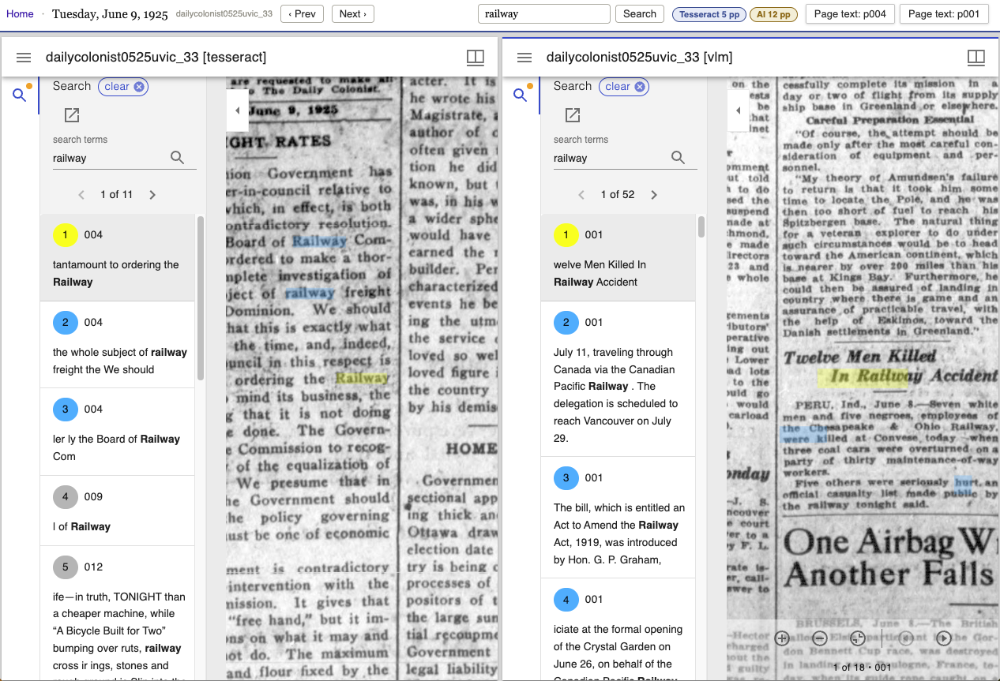](images/figure-2.png)

**Figure 2:** Side-by-side comparison of the two Phase 1 OCR pipelines on the same issue. For the query *railway*, Tesseract returns 11 results, while the VLM pipeline returns 52 and captures material that the classical OCR misses.

The hybrid's design mirrors each engine's internal architecture, so it is worth being precise about how each one actually reads, and why their failures differ.

**Tesseract is a segment-then-recognize pipeline:** it binarizes the page to black and white, segments it into lines and candidate words, then classifies each character sequence with a neural recognizer, assigning a confidence score from the network's own internal probabilities (Smith 2007). That architecture explains both its strengths and its failures. Its spatial coordinates are excellent, measured directly from page geometry. But its worst failures occur *before* confidence is ever computed: binarization destroys faint text, failed segmentation silently drops entire regions (up to 40% of a page, with no trace in the output), and oversized display type frequently fragments into multiple disconnected regions, producing incomplete or unreliable recognition. The engine can also produce high-confidence confabulations. In the case examined in §7, Tesseract assigned confidence scores of 58–88 to a non-existent character.

**A vision-language model reads by conditional generation instead**, predicting text from visual features and preceding context rather than classifying pre-segmented characters (PaddlePaddle 2025). PaddleOCR-VL implements this by first detecting typed, ordered blocks, then generating each block's text with a compact (~0.9B-parameter) model. Because nothing is discarded by binarization and nothing is pre-segmented into characters, it is not exposed to the Tesseract failure modes mentioned above. It has its own instead: a full 7,500 × 9,500-pixel page cannot simply be handed to it at once, since downscaling destroys small text and whole-page generation invites degeneration and skipped columns (Holtzman et al. 2020). This was learned empirically from failed early attempts, preserved for reference in the Phase 1 repository (`experiments/` directory). The same language priors that let the model read smudged print correctly can also let it guess in illegible regions or silently modernize period orthography, and degraded visual input specifically induces this kind of hallucination in vision-language models (He et al. 2025). The model also emits text with no word coordinates and no confidence signal; larger VLMs such as Qwen2.5-VL share the same needs (Bai et al. 2025).

The two architectures, summarized:

| Engine | Architecture type | Primary failure mode | Output limitations |
|---|---|---|---|
| Tesseract 5 | Segment-then-recognize (binarize, segment, classify) | Silent regional dropout; character-level shattering of display type; confident confabulation | Precise word-level geometry; self-reported confidence not a reliable correctness signal |
| PaddleOCR-VL | Layout-then-generate (detect blocks, decode autoregressively) | Occasional hallucinated or illegible-region guesses; silent period-spelling modernization | Block-level geometry only; no confidence signal |

The complementarity, then, is exact: the VLM reads fluently but cannot say with precision *where* a word is or *how sure* it is; Tesseract knows precisely where everything it saw is located, and roughly how sure it is, but reads badly and skips silently. Fusing the VLM's text with Tesseract's geometry and confidence lets each cover most of the other's blind spots, but not all of them. Where both engines are silent on the same region, or both confidently wrong on the same word, there is nothing for the fusion to combine, and the hybrid inherits the gap rather than closing it. The rest of this article tracks that residue in detail rather than glossing over it. Section 6 explains why 39% of the hybrid's words carry an estimated position rather than a measured one: Tesseract never saw those words, so there was nothing to measure. Section 7 describes roughly 58,000 disagreements that no rule could resolve, where both readings are indexed side by side instead of picking a winner. Sections 11 and 15 confront the coverage question directly: **how much text neither engine ever captured is not yet known**. Combining the two readers makes the result substantially better than either reader alone; it does not however make the result complete.

## 5. Phase 1: two pipelines, one viewer

Phase 1 built the comparison testbed: the same 6,647 pages processed by two independent pipelines, indexed side by side, and served through a IIIF/Mirador viewer so that any claim about either pipeline could be checked visually against the page image.

**Arm 1: Tesseract 5** (Smith 2007), TSV output: word-level bounding boxes in full-resolution pixel space and a per-word confidence score (0–100). The full-year run took 14.0 hours on CPU (~7.6 s/page).

**Arm 2: PaddleOCR-VL 1.6** (PaddlePaddle 2025; PaddlePaddle 2026a), a ~0.9B-parameter document-parsing vision-language model served via vLLM (Kwon et al. 2023) on a single NVIDIA RTX 6000 Ada (48 GB): block-segmented JSON with layout labels, block bounding boxes, no confidence reporting, and markedly higher transcription fidelity. The same GPU then ran Qwen2.5-VL-7B-Instruct (Bai et al. 2025) to generate natural-language descriptions of every image region the layout model identified (39,458 descriptions across 5,963 pages), making photographs, illustrations, and display advertisements searchable. The complete VLM pass took 30.2 hours wall-clock (~16.4 s/page). Tesseract's pass ran entirely on CPU; the VLM pass required a single GPU running continuously. The energy implications of that hardware difference are analyzed in full in §12.

[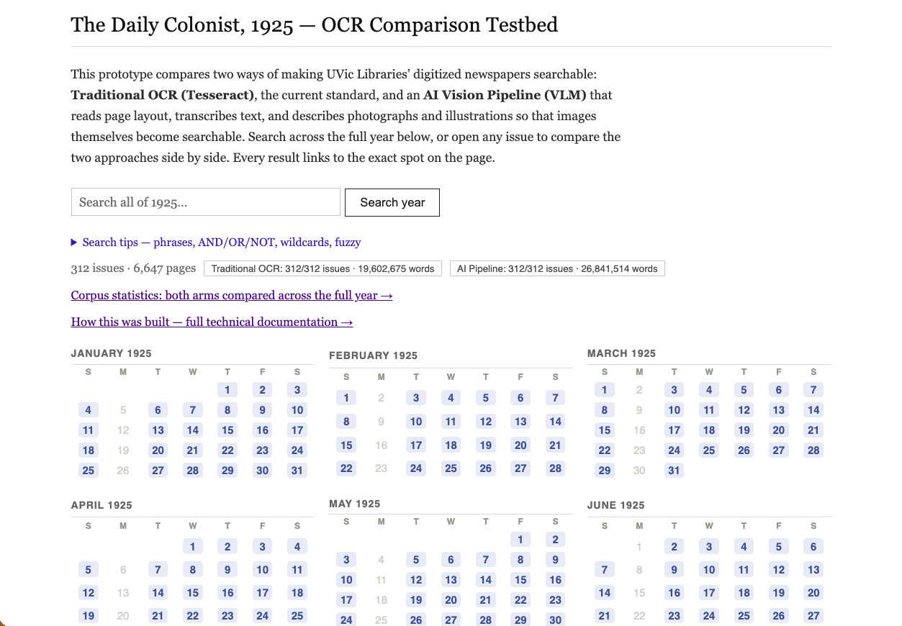](images/figure-3.png)

**Figure 3:** Phase 1 comparison testbed for the complete 1925 run of *The Daily Colonist*. The interface provides full-year search, issue-level browsing, corpus statistics, and access to side-by-side Tesseract and VLM results across 312 issues and 6,647 pages.

Both arms were converted to MiniOCR and indexed in Apache Solr via the solr-ocrhighlighting plugin (dbmdz 2024), displayed through Cantaloupe and Mirador (Cantaloupe 2024; IIIF Consortium 2017; Project Mirador 2024). MiniOCR, a minimal schema built for exactly this kind of programmatically generated OCR output, was chosen over the plugin's other supported formats (hOCR, ALTO) for its simplicity at the merge stage, where every word's box must be assembled from one of four different sources (§6); the full rationale, including the trade-off against ALTO's status as the field's interchange standard, is documented in the project repository. Because the VLM reports geometry only at block level, Phase 1 also required a converter that synthesizes per-word boxes from block geometry; its method and five documented error modes, along with an adversarial review by a second AI system, are in the Phase 1 repository (`docs/phase1-converter-technical-note.md`; §14).

Phase 1 established three things. First, **the VLM reads dramatically more of the page**: 26.8M indexed words versus Tesseract's 19.6M. Second, **the VLM's vocabulary is dramatically cleaner**: 257K unique word forms versus Tesseract's 748K, since at corpus scale OCR noise manifests as vocabulary inflation (Tesseract's top corpus-exclusive forms are *i'he*, *lhe*, and *vou*, all OCR damage rather than words). Third, **Phase 1's indexing conflated AI-generated image descriptions with page text**: a search for *railway* returned 2,717 "pages," 81 of which matched only because a 2026 model *described a picture* using that word. Phase 2 treats that conflation as an error requiring architectural correction, not a footnote (§8).

Phase 1 also produced the first statistics page for the corpus, comparing both arms under one methodology. One methodological artifact from that page shaped everything after: **the corpus lexicon, built from Tesseract's own output, is polluted by Tesseract's errors**, to the point that some misspellings outnumber their correct forms, so any "recognized %" measured against it slightly favors Tesseract, and any routing decision made with it would turn Tesseract's mistakes into authoritative indexed data. The polluted lexicon was kept as a comparable measuring stick (identical across arms, bias disclosed wherever it appears), and an external system wordlist was used for anything decision-bearing.

## 6. Phase 2: the hybrid

The central design insight is that the two arms fail in complementary ways:

| | Tesseract 5 | PaddleOCR-VL |
|---|---|---|
| Text fidelity | poor–fair on this material | good–excellent |
| Word geometry | precise, per word | block-level only |
| Confidence | per-word scores (self-reported, occasionally confidently wrong) | none reported |
| Coverage | silent regional dropout | occasional missed regions (different ones) |
| Failure texture | fragmentation, misreads, dropout | rare; some normalization of period forms |

A search system needs two things no single engine provides: the VLM's transcription and Tesseract's word-level geometry, plus an explicit account of which engine to believe wherever they disagree. The hybrid pipeline reconciles them in eight stages, run per page:

1. **Sanitize.** The VLM's raw output is cleaned: HTML markup stripped, Unicode normalized, and rare non-standard characters (emoji, mathematical notation, occasional CJK ideographs the VLM emits in place of a genuinely unreadable glyph) removed, since these break the indexing stack's character-offset arithmetic (implementation detail in the project repository).
2. **Deduplicate.** The VLM occasionally emits the same region twice, a byproduct of its layout detector's region proposals overlapping at column boundaries or dense advertising blocks (§4). Duplicates are merged only under strict conditions (exact containment, or hyphenation continuation); a fuzzier similarity-based approach was built and rejected after it wrongly merged genuinely distinct rows in shipping tables.
3. **Regroup.** Tesseract's output is brought into the VLM's page structure: each Tesseract word is assigned to whichever VLM block contains its center point. Words falling inside no VLM block are set aside for the rescue stage.
4. **Align.** [FIGURE: character-level alignment diagram showing the four geometry-inheritance cases] Within each block, the VLM's words are matched to Tesseract's by character-level alignment. Word-level matching would not work here, because Tesseract's own word boundaries are themselves often wrong (§4): a printed word can arrive as several disconnected fragments, or several words can arrive fused into one token. Character-level comparison still finds a correspondence even when word boundaries on the two sides disagree, which is the whole reason this stage exists: it is what lets a fluent but ungrounded VLM transcript inherit precise, measured geometry from a badly segmented but spatially accurate one. The alignment outcome determines the geometry, falling into one of four cases (one-to-one; fused-token proportional slice; multi-fragment union; or no alignment, interpolated), with a safeguard, the *shrapnel rule*, that falls back to interpolation rather than forcing a nonsensical match when a badly shattered fragment is claimed by multiple unrelated words. Worked examples for all four cases appear in Table 1.
5. **Route disagreements.** [FIGURE: routing cascade decision-tree diagram for disagreement resolution] A decision cascade resolves conflicting readings in order: identical after punctuation normalization; low Tesseract confidence; a truncated Tesseract read; an external dictionary vote. The roughly 498,000 positions (1.9% of the corpus) that survive all four tests are indexed under *both* readings rather than forced to one, a genuine residual limitation rather than a rounding error: every one of these token positions has no single agreed-upon reading in the index. Of these, about 58,000 numeric disagreements receive further scrutiny in §7; the remainder are indexed as-is with no further arbitration attempted.
6. **Rescue.** [FIGURE: rescue stage diagram showing clustering, confidence filtering, and splicing] Tesseract words in regions the VLM never transcribed are recovered rather than discarded: clustered into blocks by adaptive two-dimensional clustering (distance threshold scaled to local type size), filtered against Tesseract's own confidence score, and spliced into the VLM's reading order based on their column position. Verified corpus-wide at 0.022% ordering violations across 926K block pairs. Without this stage, content the VLM tends to skip, most notably headlines and advertisements, would be entirely unsearchable. A worked example appears in Table 1.
7. **Dehyphenate.** Words split across line breaks are rejoined only when an external dictionary confirms the rejoined form is real.
8. **Emit.** The final output pairs every word's bounding box with a provenance sidecar: one of twelve classes recording exactly how that word was produced.

[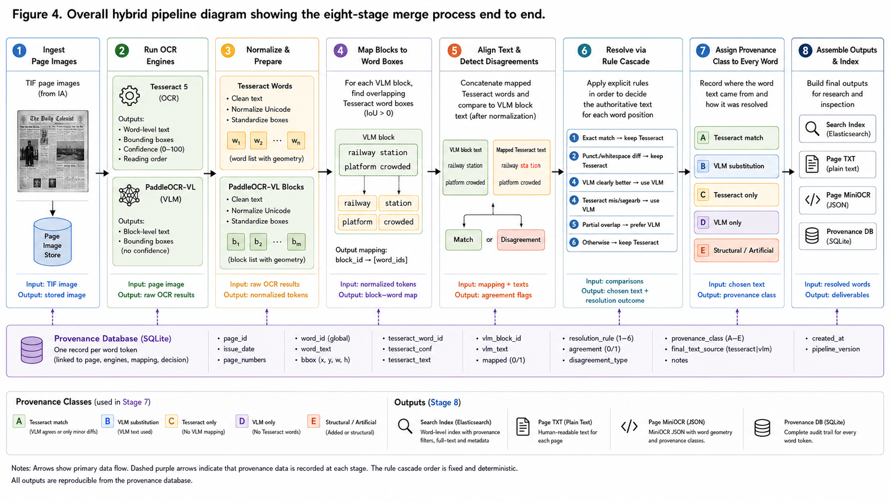](images/figure-4.png)

**Figure 4:** Overall hybrid pipeline from page-image ingest to searchable, provenance-tracked output. Tesseract and PaddleOCR-VL are run independently, their results are normalized and aligned, disagreements are resolved through explicit rules, and every final word is assigned a provenance class before indexing.

**Table 1: Alignment and Rescue Edge Cases.** Illustrative examples for the mechanisms described in stages 4 and 6; the *Union Wharf*, *ESQUIMALT*/shrapnel, *Hibben-Bone*, and classified-notice cases are constructed to demonstrate the mechanism and are not asserted as verified instances from the corpus.

| Case (stage) | Situation | Worked example |
|---|---|---|
| One-to-one (4) | Both engines produce exactly one token for the same text | Roughly one-third of all words; the VLM word inherits Tesseract's measured box directly |
| Fused token, proportional slice (4) | Tesseract merges two printed words into one garbled token | Tesseract reads *Union Wharf* as the fused token *UnionWharf*; the VLM's two words each receive a proportional share of that one box |
| Multiple words, union (4) | Tesseract's shattering splits one printed word into fragments the VLM reads as a whole | Tesseract breaks the headline *ESQUIMALT* into *ESQUI* and *MALT*; the VLM's single token receives the union of both fragment boxes |
| No alignment, interpolated (4) | The VLM read a word Tesseract never emitted in any form | Tesseract's line reads only *the* and *Company*; a dropped business name such as *Hibben-Bone* gets a box interpolated between its two measured neighbors |
| Shrapnel rule (4) | A badly shattered fragment is claimed by multiple unrelated VLM words | A two-letter fragment *AL* is claimed by *ROYAL*, *NAVAL*, and *ARSENAL*; rather than force a nonsensical split, the system falls back to interpolation |
| Rescue (6) | The VLM skips a region entirely (commonly headlines or small ads) | A classified notice, *FOR SALE: cabin cruiser, apply Box 47*, is clustered from orphaned Tesseract words, filtered for low-confidence misreads, and spliced into the reading order between its neighboring VLM blocks |

[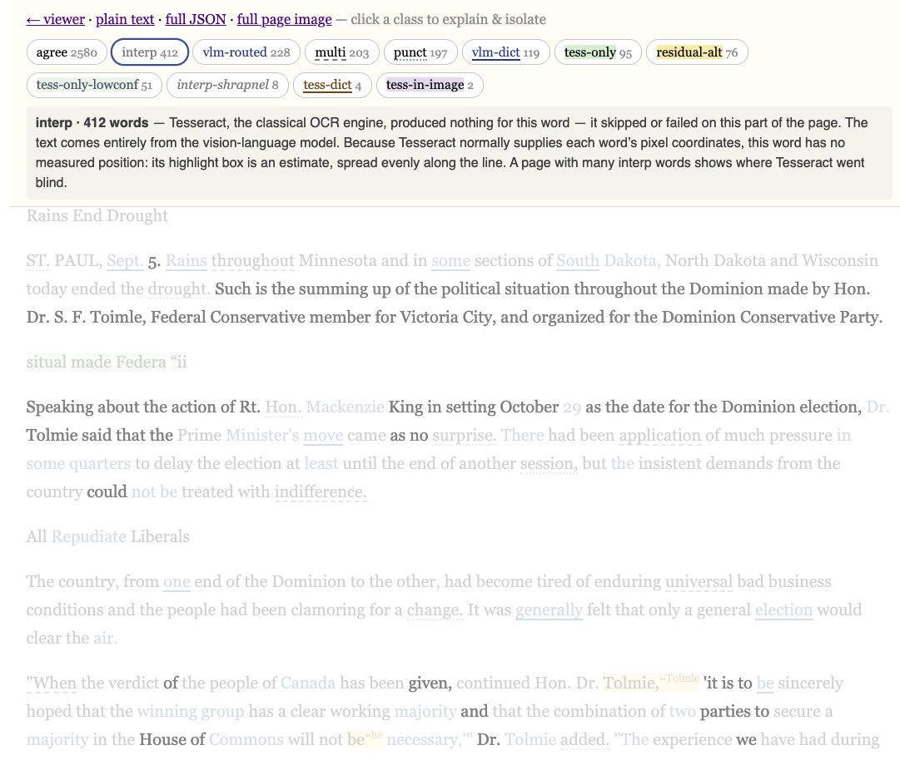](images/figure-5.png)

**Figure 5:** Provenance-painted text view with the `interp` class isolated. The interface explains that these words come from the VLM because Tesseract produced no corresponding token; their highlight boxes are therefore estimated along the line rather than inherited from measured Tesseract coordinates.

[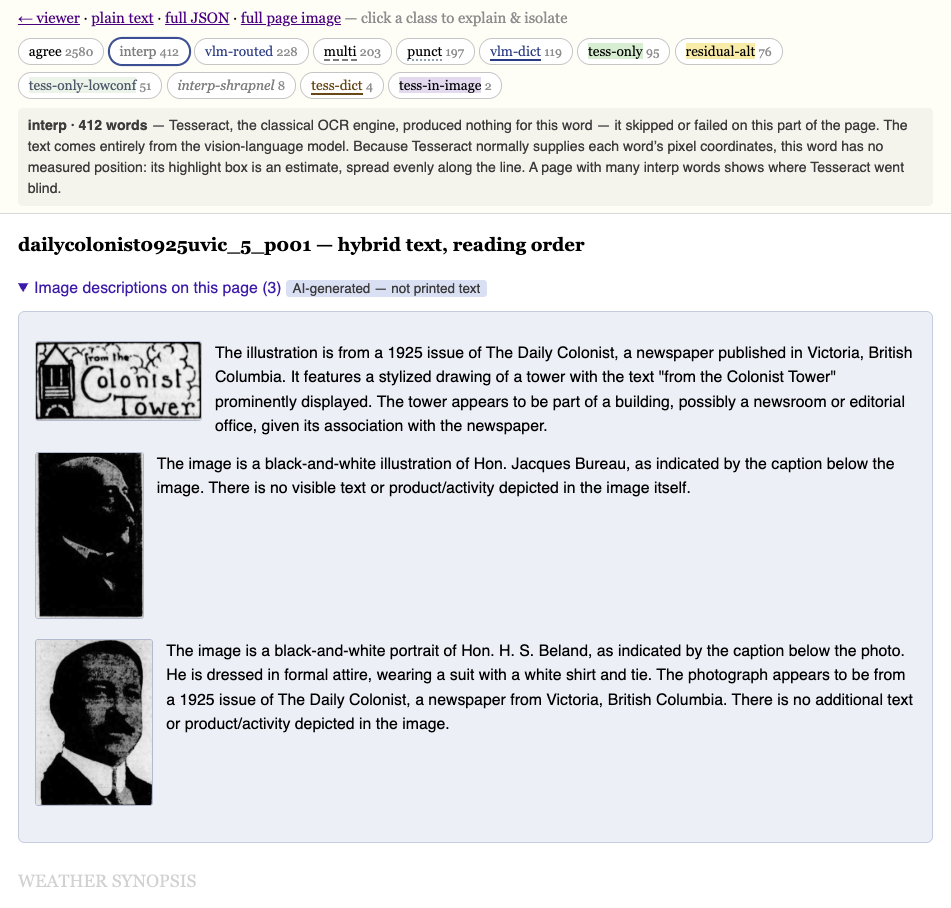](images/figure-6.png)

**Figure 6:** Image descriptions displayed as a separate, explicitly labelled layer. Thumbnail crops are paired with AI-generated descriptions, while the “AI-generated — not printed text” notice distinguishes this material from the newspaper’s searchable ink text.

[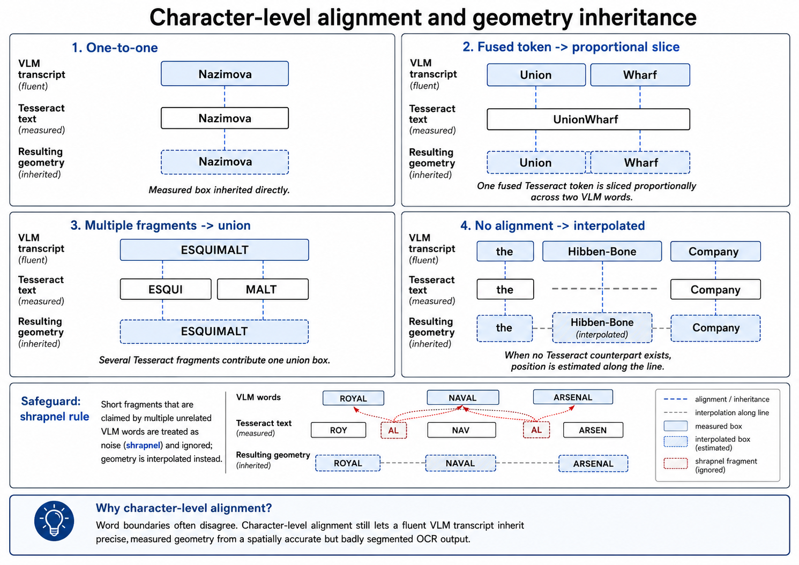](images/figure-7.png)

**Figure 7:** Character-level alignment and geometry inheritance. VLM words receive measured Tesseract geometry through direct transfer, proportional slicing of fused tokens, or union of fragmented tokens; when no counterpart exists, position is interpolated. The shrapnel rule prevents short, ambiguous fragments from producing false alignments.

[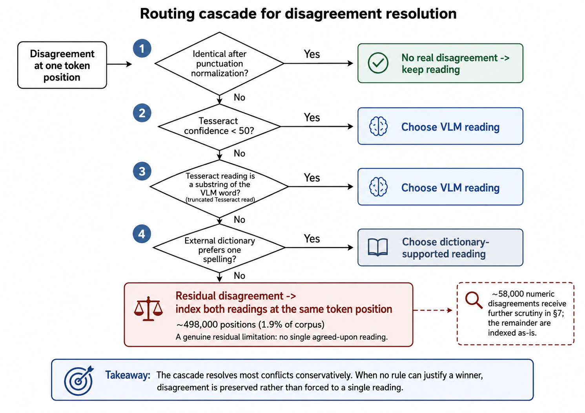](images/figure-8.png)

**Figure 8:** Routing cascade for disagreement resolution. Conflicting readings are tested in a fixed order: punctuation-normalized agreement, low Tesseract confidence, truncated Tesseract text, and external-dictionary support. When no rule establishes a defensible winner, both readings remain indexed at the same token position.

[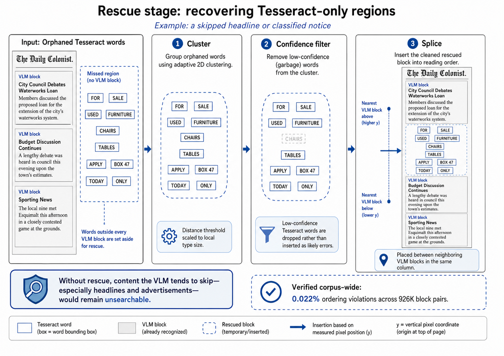](images/figure-9.png)

**Figure 9:** Rescue of Tesseract-only regions. Words outside every VLM block are clustered spatially, low-confidence items are removed, and the surviving block is inserted into the VLM reading order according to its page position, recovering skipped headlines and advertisements.

**Each word's provenance class is what makes the index auditable rather than merely better.** A downstream consumer, the project's own viewer, or a future researcher's script, can determine with a single lookup exactly which engine produced a given word, what it read, and how its position was derived, without re-running the pipeline or trusting an unstated assumption. This matters beyond this one project: as OCR engines improve, a library will eventually need to know which parts of an index to trust, which to re-check, and which to replace, and a per-word provenance record is what makes that kind of selective, evidence-based reprocessing possible rather than an all-or-nothing re-run. The corpus-wide distribution of the twelve classes: `agree` 35.7% (both engines identical); `interp` 39.1% (text from the VLM only, in an interpolated box, a direct, per-page-visible measurement of Tesseract's dropout); `vlm-routed` 6.6% (disagreements the cascade resolved in the VLM's favor); `tess-only` 4.6% (rescued words); `punct` 3.5%; and seven smaller classes each below 3%. The viewer exposes this directly, coloring every word by class with a sticky legend and a click-to-isolate function that reveals the spatial pattern of an engine's failures on a page at a glance. The claim being made is deliberately not "this text is correct." It is: "this text can tell you how it was made, word by word." The full merge algorithm and its rejected alternatives are documented in the Phase 2 repository (`docs/phase2-merge-technical-note.md`).

Indexing follows the Phase 1 infrastructure, with three additions: image descriptions are stored in a separate, mode-gated field never counted as page text; matching image blocks are returned as IIIF annotations, so a hit in image mode draws an outline around the actual advertisement or illustration; and zoom-to-hit takes a user directly to the highlighted word at reading magnification.

## 7. The arbitration study: built, evaluated, not deployed

After the routing cascade, approximately 58,000 disagreements remained in the *numeric band*: readings no dictionary can adjudicate because the disputed tokens are prices, quantities, and measurements (Tesseract reading *45¢* where the VLM read *45c*). One approach to this problem is to use a judge model: crop the disputed word, present both candidate readings to a multimodal LLM, and accept its verdict. The complete harness was built and evaluated, and the results are a documented negative result. The clearest finding, addressed first below, is that one model's verdicts tracked which option was labeled first, not what the image showed.

Four judge models were tested:

| Model | Behavior | Errors corrected |
|---|---|---|
| Qwen2.5-VL-7B | Exhibited **position bias**: in 14 of 16 instrumented crops, swapping which reading was labeled A and which was labeled B reversed the model's verdict. Invented plausible-looking prices when asked to transcribe illegible crops blind. | 0 (unreliable) |
| Qwen3-VL (8B, 32B) | Did not exhibit hallucination; declined when a crop was illegible rather than guessing. Confirmed the existing reading in every case it could resolve. | 0 |
| MiniCPM-V 4.5 | Changed the indexed reading in exactly two cases. | 0 (both changes wrong against the printed page) |
| DeepSeek-OCR | Trained for full document pages, not single-word crops; produced output belonging to entirely different document types, including invented mathematical equations. | 0 |

The decisive step was verifying the evaluation set itself. Its 16 crops had been labeled automatically: whatever Tesseract read with high confidence was treated as correct. Compared directly against the printed page, the labels were wrong. The experiment's central example, a disputed ¢ sign, does not exist on the page at all: the printed character is a plain *c*, and Tesseract had invented the ¢ while reporting confidence 58–88. In all seven cases a human could resolve by inspection, the VLM's reading was correct. The numeric band is therefore indexed with the VLM's readings as primary with no automated arbitration, a decision based on measurement rather than assumption. The judge harness is archived in a judge-agnostic form, with a written acceptance protocol whose *first step* is now to verify the evaluation labels against the printed page before trusting anything the system reports.

[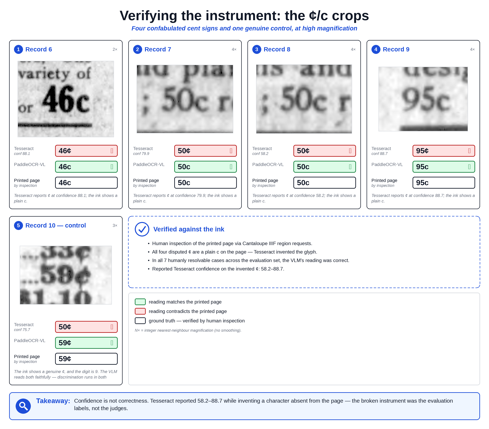](images/figure-10.png)

**Figure 10:** Verification of the disputed ¢/c evaluation crops. In four cases Tesseract reports a cent sign, at confidence 58.2–88.7, although the printed page contains a plain *c*; the fifth crop is a genuine cent-sign control correctly read by the VLM. The comparison shows why OCR confidence cannot be treated as ground truth.

Three lessons generalize beyond this project. First, **position bias in multimodal A/B judging is severe enough in some cases to invert results entirely**; when swapping labels reverses verdicts, the verdicts are not measuring what the image shows, and any judging protocol built on option comparison needs label-swap controls as a basic safeguard. Second, **confidence is not correctness, even for classical OCR**: Tesseract invented a character absent from the page while reporting confidence 58–88, joining the ABBYY first-letter confabulation (§9) in a growing catalogue of structural error modes that no model of OCR error as "misspelling" would predict; the pipeline described here treats confidence only as a coarse routing and rescue heuristic. Third, **document reading is a specialization, not an emergent property of general model strength**: the study's most striking failure, DeepSeek-OCR producing equations from a 1925 price crop, was a model reproducing the conventions of the documents it knows rather than reading the one in front of it. The tools that did not exhibit hallucination were either parsers tuned for document tasks or models evaluated under protocols that let them abstain, consistent with the broader finding that degraded visual input specifically induces VLM hallucination (He et al. 2025), and with the HIPE-OCRepair organizers' observation that task-specific adaptation and explicit hallucination controls, not raw model size, predicted good performance (Ehrmann et al. 2026).

## 8. Separating Text from AI-Generated Description

In Phase 1, image descriptions were mixed with page text in a single index, inflating the VLM arm's apparent findability: the conflated index returned 2,717 pages for *railway* versus 2,636 when only printed words were counted. Phase 2's correction is architectural: descriptions live in their own field; the interface presents printed text and images as two distinct, labeled search modes; every place description text appears carries an "AI-generated, may contain errors" tag; and the comparative statistics compute the VLM arm from ink-only text. The change also *measured* the contamination precisely: roughly 2.7 million words of description prose had been counted as page text in Phase 1.

A second, more subtle problem sat alongside the conflation issue: the descriptions themselves were often written in visibly modern vocabulary. Qwen2.5-VL routinely reached for words like *stylized* to characterize period display type, language no 1925 compositor or reader would have used and not what a researcher searching for period-authentic text would expect. Even once descriptions are correctly separated into their own field and mode, the vocabulary inside that field remains 2026 prose narrating a 1925 image (§11), labeled as machine-generated rather than corrected toward some hypothetical period register, since attempting that correction would raise the same overcorrection risk documented throughout this article's other post-processing decisions (§7).

Despite this, the descriptions are a genuine gain in access. A search for *cathcarts* in images mode finds the stylized "CATHCARTS" logotype advertisements that no OCR arm reads reliably: Tesseract finds 0 pages, the hybrid's ink text 2, ABBYY 3, and the image descriptions 6. A search for *locomotive* finds pictures of locomotives, not just the word in print. The governing rule is the one applied throughout the system: machine-generated text is included, but it must be labeled as machine-generated.

## 9. The fourth arm: diagnosing the ABBYY layer

Because the collection's real-world access runs through the Internet Archive's ABBYY-era text, any claim of improvement had to be measured against it.

**Methodology.** Pages-with-match were counted for four benchmark queries directly against the Internet Archive's own search index (*railway* 1,818; *esquimalt* 88; *burridge* 1; *telephone* 993), then validated against a locally built ABBYY index assembled from the collection's underlying hOCR, itself a conversion of the original 2015 ABBYY output (Internet Archive 2020). The local index confirmed the API counts almost exactly (*railway* 1,826 versus 1,818, the difference accounted for by one permanently unindexed issue), giving this fourth arm the same standing as the other three: instant, complete, highlightable, and an independent check on the findings below.

**Findings.** The ABBYY column was internally inconsistent: 2.5x better than Tesseract on *railway*, 14x worse on *esquimalt*. Direct comparison against the raw ABBYY text identified the cause: an issue where the hybrid finds *Esquimalt* on 12 pages contains, in its entire ABBYY text, exactly one clean *esquimalt*, and many first-letter-mangled variants (*dhquimalt*, *kxquimalt*, *kaqnimalt*) that prefix-anchored searching can never find. This is a systematic first-letter confabulation on display capitals, and it also explains the *telephone* shortfall (§10): each issue's masthead prints the newspaper's own contact information, "COLONIST TELEPHONES," in the same display capitals, mangled the same way.

A methods lesson followed from how this finding was reached. The first variant census searched for forms starting with the same letters as *esquimalt*, on the reasonable assumption that a garbled OCR reading would still get the first few characters right. That search found almost nothing, and nearly led to the wrong conclusion, that ABBYY had simply dropped these words from the page entirely. The actual cause only became visible once the search was anchored on the word's *ending* instead, a wildcard pattern such as `*imalt`, which caught every garbled form regardless of how its first letter had been misread, confirming that the words were present all along, just corrupted in exactly the position the first search had assumed would be reliable.

[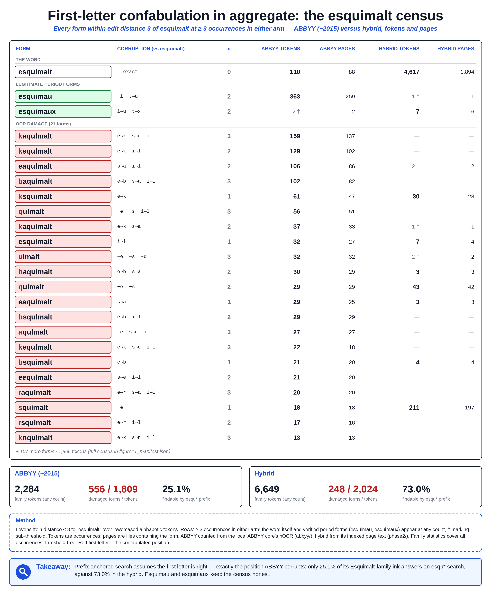](images/figure-11.png)

**Figure 11:** Aggregate census of forms related to *esquimalt*. ABBYY produces numerous recurrent first-letter corruptions, including *kaqulmalt*, *ksqulmalt*, *eaqulmalt*, and *baqulmalt*, while the hybrid retains a much cleaner vocabulary. Only 25.1% of ABBYY’s Esquimalt-family tokens remain findable through an `esqu*` prefix, compared with 73.0% in the hybrid.

## 10. Findings

Across four generations of OCR on identical scans, the hybrid finds more than any prior system on nearly every query, and where it does not, the exception is itself informative.

**Findability, four generations, identical scans** (pages with ≥1 match):

| query | Tesseract 5 | ABBYY ~2015 | Hybrid | Image descriptions |
|---|---|---|---|---|
| railway | 731 | 1,818 | **2,636** | 295 |
| esquimalt | 1,251 | 88 | **1,871** | 8 |
| burridge | 14 | 1 | **26** | 0 |
| cathcarts | 0 | 3 | 2 | **6** |
| telephone | 1,700 | 993 | **2,424** | 493 |

[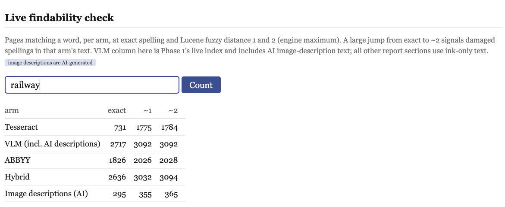](images/figure-12.png)

**Figure 12:** Live findability check for *railway*. The interface compares exact matches with Lucene fuzzy distances one and two across all four OCR arms and the separate image-description field, making visible both recognition damage and the gains produced by the hybrid.

The hybrid outperforms the collection's existing commercial layer by ~45% on the highest-volume query (*railway*), and on *burridge* recovers content no prior system, open or commercial, ever indexed. The one exception, *cathcarts*, is instructive: on stylized display logotypes, decade-old ABBYY slightly outperforms the hybrid's ink reading, and the AI descriptions win outright, because they describe the picture rather than reading the logotype.

**Corpus-scale measures, one methodology across arms** (ink-only; ≥4-character tokens against the corpus lexicon at frequency ≥3):

| | Tesseract 5 | VLM (ink) | ABBYY ~2015 | Hybrid |
|---|---|---|---|---|
| words | 19.60M | 24.11M | 27.11M | 26.89M |
| unique forms | 747,995 | 347,973 | 3,627,439 | 341,484 |
| forms exclusive to arm | 422,831 | 99,384 | 3,387,600 | 6,876 |
| dictionary-recognized | 92.76% | ~97.4% | [lowest of the four; exact figure to confirm in revision] | 97.21% |

ABBYY's largest-volume-but-most-damaged profile and the hybrid's disciplined vocabulary, its exclusive-form count is two orders of magnitude smaller than any other arm, are visible directly in the table above; word-length distributions confirm it from another angle, with the damage-heavy arms bulging at 1–2 characters relative to the VLM and hybrid curves.

[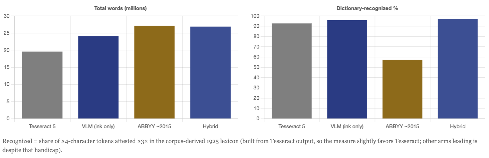](images/figure-13.png)

**Figure 13:** Corpus-scale word counts and dictionary-recognized rates under one methodology. The VLM and hybrid combine high coverage with cleaner vocabulary, while ABBYY produces the largest number of tokens but the lowest recognized rate. The corpus-derived lexicon slightly favours Tesseract because it was built from Tesseract output.

[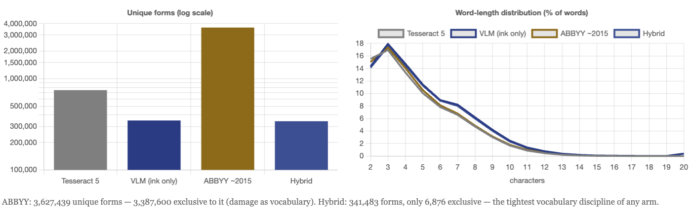](images/figure-14.png)

**Figure 14:** Vocabulary size and word-length distribution by OCR arm. ABBYY’s unusually large number of unique forms reflects OCR damage expressed as vocabulary inflation, whereas the hybrid has the smallest exclusive vocabulary. Excess short tokens in the damage-heavy arms provide a second measure of fragmented recognition.

**Confidence deserves particular attention, because it holds this section's least intuitive result.** Tesseract's per-word distribution is clearly bimodal: 9.65M words at confidence 90+, 1.29M at 0–9, which is why confidence gating works as a rescue filter and why the confabulation cases (high confidence, wrong glyph) are the important exceptions rather than the rule. ABBYY's distribution is the mirror image: of its 27.1M words, 11.1M carry confidence 0–9 and only 989K reach 90+. The commercial OCR layer’s own confidence scores, preserved through the hOCR conversion, classify most of its output as unreliable; nevertheless, the collection has relied on that text for search for more than a decade. Confidence metadata that is recorded but never acted on is one of this project's more consequential findings about mass-digitization practice generally, not just about this one collection.

[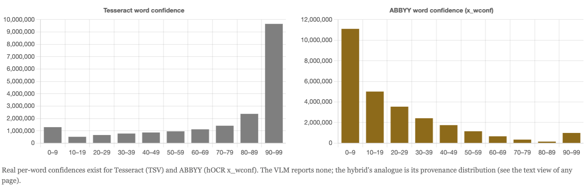](images/figure-15.png)

**Figure 15:** Per-word confidence distributions for Tesseract and ABBYY. Tesseract is strongly concentrated in the highest confidence band, whereas ABBYY shows the near-opposite pattern, with most tokens assigned very low confidence despite having served as the collection’s search layer for more than a decade.

A live "findability check" widget on the report page demonstrates the central phenomenon interactively: ABBYY's *esquimalt* count jumps dramatically at fuzzy distance 2 as the first-letter damage comes into range, while the hybrid's exact and fuzzy counts nearly coincide. Fuzzy matching partially compensates for character damage but cannot compensate for structural failure modes, and it never compensates for dropout, because no edit distance can match text that was never extracted.

[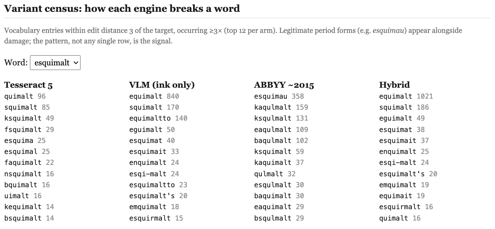](images/figure-16.png)

**Figure 16:** Four-arm variant census for *esquimalt*. The most frequent nearby vocabulary forms reveal how each engine damages or normalizes the word; legitimate period variants such as *esquimau* are retained so that the comparison distinguishes historical usage from OCR error.

## 11. Limitations, and how each was addressed

**No ground truth.**
- *Limitation:* This project has no verified, human-transcribed version of any page to measure against, so nothing reported here is a character-error rate in the usual sense.
- *Impact on the data:* Reported accuracy signals (dictionary match rates, engine confidence, vocabulary garbage measures) are correlates of accuracy rather than direct measurements (Springmann, Fink, and Schulz 2016; Fink, Schulz, and Springmann 2017; Cuper et al. 2022), and no precision or recall figure in this article can be validated against a verified transcript.
- *Mitigation:* This project adds two things that literature usually lacks: four different engines reading the same images, so independent-engine agreement is itself evidence of correctness, and targeted human verification at every point where a decision depended on being right (the arbitration study's disputed crops, 7 of 7 checked; the ABBYY anomaly investigation; spot checks of the alignment step), following the rule that any number used to make a decision was verified against the page before it was written down. What remains missing is a proper double-keyed sample, 20 to 30 pages independently transcribed twice and compared, which would let this corpus be measured against a live benchmark using the field's newly standardized metrics: a character match error rate alongside a per-unit preference score (with a public scorer: Ehrmann et al. 2026).

**The lexicon contains inherited errors.**
- *Limitation:* The recognition percentages use a Tesseract-derived lexicon containing Tesseract's own errors.
- *Impact on the data:* Any "recognized %" figure computed against this lexicon is not an absolute measure and slightly favors Tesseract.
- *Mitigation:* The same polluted instrument was used identically across all arms, preserving comparability, with the bias disclosed on every page that shows it; an external wordlist was used instead for all routing decisions.

**Interpolated boxes are estimates.**
- *Limitation:* 39.1% of hybrid words carry line-proportional boxes rather than measurements. A related ~0.7% scale error affects highlight geometry on pages where Tesseract's reported page dimensions differ from the served image's.
- *Impact on the data:* Highlights in interpolated regions land on the right line but not always on the exact word.
- *Mitigation:* Both issues are disclosed, per word in the provenance record and viewer legend for the interpolation case, and as a queued fix (documented in the project's working state file) for the scale error. §15 describes a forced-alignment path for converting the interpolated estimates into true measurements.

**Description quality.**
- *Limitation:* Qwen2.5-VL descriptions are sometimes generic, occasionally wrong, and always 2026 prose about 1925 images.
- *Impact on the data:* A description could be mistaken for period-authentic text, or could simply mislead a researcher relying on it.
- *Mitigation:* Descriptions are quarantined by field, by search mode, and by an "AI-generated" label; they are never counted as page text; and the one place they leak semantics (the live fuzzy widget's VLM column, which queries the Phase 1 index) discloses this in its caption.

**Period orthography.**
- *Limitation:* The suspect-form censuses identified candidate cases of the VLM silently modernizing period spellings (*romania* for *Roumania*, *halloween* for *Hallowe'en*) and possible math-notation leakage from table regions, such as the suspect form *fracpi*, LaTeX-style markup that reads as "frac" plus "pi" rather than any word a compositor would have set, a milder version of the failure DeepSeek-OCR showed outright in §7.
- *Impact on the data:* If confirmed, these represent silent, undisclosed alterations of the printed text, unlike the disclosed interpolation and description issues above.
- *Mitigation:* These are flagged for spot verification; if confirmed, they join the error-mode catalogue as VLM-class entries, itself a useful outcome, since VLM failure modes on heritage material are far less documented than Tesseract's (He et al. 2025).

**One year, one paper, one language.**
- *Limitation:* Everything here is measured on English-language broadsheet microfilm from a single title-year.
- *Impact on the data:* The specific numbers reported (findability counts, error rates, class distributions) do not generalize to other languages, typefaces, or decades.
- *Mitigation:* The architecture itself is corpus-agnostic; nothing in the pipeline design assumes English or 1925-era typography specifically.

## 12. Sustainability: what 150 years would cost

The question a library actually faces is not "is the hybrid better?" but "is it worth running at collection scale?" The project's own runs were measured and the arithmetic was done with labeled assumptions.

Measured, this corpus (6,647 pages):

| stack | wall-clock | per page | hardware |
|---|---|---|---|
| Tesseract 5 | 14.0 h | 7.6 s | CPU (existing server) |
| VLM stack (OCR + image descriptions) | 30.2 h | 16.4 s | 1× RTX 6000 Ada (48 GB) |

**Energy and carbon.** Converting wall-clock time to estimated device power draw (the RTX 6000 Ada assumed at ~250 W average against its 300 W TDP, plus ~100 W host overhead; Tesseract's CPU-only run at ~180 W) puts the VLM stack's yearly cost at approximately 10–13 kWh against 2–3 kWh for Tesseract, a substantially larger energy gap than the 2x wall-clock difference, because the GPU draws far more power per hour than the CPU it replaces. Model choice drives this: general-purpose generative systems cost orders of magnitude more energy per inference than task-specific ones (Luccioni, Jernite, and Strubell 2024), and this stack was chosen deliberately to sit at the efficient end of that range, a ~0.9B-parameter parser plus a 7B captioner, rather than a large general-purpose model queried separately for every image region. Scaled to the full *Colonist* run, roughly 150 years and 800,000 pages, the VLM stack would cost an estimated 1,300–1,600 kWh against 300–360 kWh for Tesseract. On British Columbia's ~98% hydroelectric grid (BC Hydro n.d.), that comes to around 15–40 kg CO₂e for the entire 150-year re-read, about the same as driving an average passenger car 60–160 km (US EPA 2023); even at world-average grid intensity (IEA n.d.) it is roughly 650–770 kg, equivalent to about 2,600–3,100 km of driving. For this workload on this grid, the measurements do not support the general assumption that AI processing necessarily carries a heavy carbon cost, though the same caution (Luccioni, Jernite, and Strubell 2024) applies in full to teams reaching for a large general-purpose model instead of a small, task-tuned one. The exact host configuration and grid-intensity source behind these figures are documented in the project repository.

The practical constraints are elsewhere. Wall-clock and capital matter more than energy: 800K pages is roughly 3,600 GPU-hours, meaningful contention for shared research hardware or a modest cloud expenditure, versus Tesseract's CPU job, which runs on any idle capacity. Storage is negligible, gigabytes per year of output. Personnel costs dominate the pipeline's real scaling cost: QA sampling, error-mode triage per decade of typography, and the provenance discipline this article documents, discussed further in §14. And re-runs are inexpensive, since the architecture stores every intermediate output, so a better model in 2028 re-runs one stage rather than the whole project, the same conclusion the Library of Congress's 2025 reprocessing announcement reaches at field scale (Library of Congress 2025): OCR layers are now living derivatives, not one-time artifacts.

## 13. Compute strategy: prototype local, scale by renting

Building and testing the pipeline on a single owned GPU suited development: fast iteration and full control while the merge logic was still being debugged. Reprocessing the full 150-year run is a different kind of decision: a one-time or, at most, once-per-decade burst of about 3,600 GPU-hours (§12), not a standing production workload, which favors renting capacity over buying more of it.

Three practical paths exist. **Buying** additional GPUs runs to tens of thousands of dollars in capital cost (NVIDIA n.d.; B&H Photo Video n.d.) for hardware that would then sit mostly idle between infrequent reprocessing cycles, a case that only holds if reprocessing becomes a recurring institutional workload rather than the occasional, multi-year event described in §12. **Renting commercial cloud capacity** (AWS or a comparable provider) covers the full run for a few thousand dollars (Amazon Web Services n.d.), with regional availability and data residency the main institutional consideration; specialized GPU marketplaces undercut standard cloud pricing further (GetDeploying 2026), at some cost to compliance tooling and guaranteed availability. **Canadian academic HPC**, the Digital Research Alliance of Canada, offers federally funded GPU clusters to Canadian academic researchers at no direct cost (Digital Research Alliance of Canada n.d.). Eligibility for the Academic Principal Investigator role explicitly includes librarians alongside faculty, so a library-led team can hold the PI role directly. This project's full run, about 0.4 GPU-years, sits comfortably under the roughly 15 GPU-year threshold that triggers the Alliance's competitive allocation process, meaning ordinary account access could plausibly cover it without ever competing for resources.

| path | approximate cost for the full run | data stays in Canada | best fit |
|---|---|---|---|
| Buy additional GPUs | tens of thousands (capital, one-time) | yes | recurring, frequent reprocessing |
| Commercial cloud (AWS or similar) | low thousands | usually, region-dependent | strict project timelines |
| Specialized GPU marketplace (spot) | roughly CA$2,000–4,000 | not guaranteed | lowest cost, tolerant of interruption |
| Digital Research Alliance of Canada | ~CA$0 direct cost | yes | non-urgent academic project, library PIs qualify |

For a project shaped like this, renting is preferable to buying, and Canadian academic institutions should check Alliance eligibility, where a librarian can hold the PI role directly, before paying a commercial cloud. Buying hardware only becomes justified if this kind of reprocessing turns from an occasional, decade-scale event into a recurring one.

## 14. Development methodology: AI-assisted development under a verification protocol

This project was substantially developed with AI assistance. The pipeline code, the viewer, the evaluation harnesses, and large parts of the analysis were written in working sessions with Claude (Anthropic), under a working protocol that evolved under pressure. The protocol is reported here as a systems-development methodology in its own right, reproducible by other library technology teams, because the failure modes encountered in this project are the failure modes any GLAM team adopting this style will hit.

The rules, as they stood at the end of the project:

1. **A human runs every command.** The model has no access to the production server; the operator runs each command and pastes results back. Nothing executes unreviewed.
2. **One step at a time, rationale attached.** Each step is a single verifiable action with its "why" stated before its "what." Multi-step blocks hide failures; the project's worst debugging detours began as compound commands whose middle silently failed.
3. **Verify before acting.** Inspect the actual file, config, mount, or API response before patching against an assumed one. Every costly incident in the project's history was a confident action on unverified state.
4. **Patches assert their anchors.** Code edits match a unique, verbatim anchor string and refuse to run on zero or multiple matches, so a mis-targeted patch halts with a reported error instead of writing somewhere wrong.
5. **Syntax-check, then import-check.** Every patched file passes a syntax check before being written; after a startup crash that syntax checking alone could not catch (valid syntax, but a runtime import error), a module initialization check was added, running before every relaunch.
6. **No silent exception handlers.** One overly broad exception handler converted a missing-function bug into four rounds of misdirected diagnosis; handlers must log the exception they suppress.
7. **Verify rendered output by rendering.** Pages are checked as rendered text, not by regexing markup, a lesson learned after a diagnostic round was wasted on a wrong-table grep.
8. **Verify the instrument before trusting its verdicts.** Ground-truth any evaluation apparatus against reality (here: the printed page) before acting on what it reports: the rule that prevented the arbitration study from publishing a wrong conclusion.

Each rule was added after a specific failure. The costliest incident: early in Phase 2, the model stopped two Docker containers to free GPU memory without checking that they were self-deleting, destroying both and forcing reconstruction of launch configurations from shell history; "verify before acting on infrastructure" became the first rule of the collaboration afterward. Other lessons of this kind appear throughout this article where they occurred: the position-biased judge, the polluted lexicon, the inverted ground-truth instrument, the prefix-anchored census that nearly published the wrong conclusion.

Two practices supplemented the protocol. First, the project's working state file, a running lab notebook of decisions, verified facts, and open questions, is published as-is in the Phase 2 repository as the development record, failures and repairs included. Second, an adversarial cross-model review was undertaken: the Phase 1 converter was submitted to a second AI system (Google Gemini) for a critical architectural review, published verbatim in the repository. The review identified five substantive weaknesses, several of which Phase 2's geometry inheritance and rescue design subsequently superseded, and all of which remain published so that consumers of the Phase 1 data understand its limits. Having one model review another's work is inexpensive, catches substantive issues, and, critically, the review, like every other machine-generated artifact in this project, is labeled as what it is.

Two observations in retrospect. First, the speed gain holds up: two phases, four indexes, a full scholarly viewer, and this evaluation corpus were built in roughly a month of part-time sessions, a schedule implausible for a solo developer working conventionally. Second, the model's characteristic failures are confident wrong assumptions about hidden state, exactly the class of error the protocol's verify-first and one-step rules exist to catch. The project's findings parallel its development process: the OCR engines, the judge models, and the coding assistant all fail by *confabulating plausibly*, and the countermeasure, in every case, was instrumented verification against ground reality, plus provenance so later readers can audit what was decided and why. Given the chance to do this again, the choice would be the same on both counts: work with AI assistance, and keep the verification rules that made that collaboration safe.

## 15. Future work

**Converting estimates into measurements is the most consequential next step.** The 39.1% `interp` class exists because the pipeline currently asks a *recognizer* to solve a *geometry* problem: a word Tesseract never emitted has no measured box to supply. But once the hybrid exists, the text of those regions is *known*, and placing known text onto an image is a solved problem with a name, forced alignment (Kiessling 2025). A forced-alignment pass over the `interp` regions would convert that provenance class from *estimated* to *measured*, and its alignment score would supply the per-word confidence signal the VLM's decoder never reports, closing both of the hybrid's disclosed gaps at once. Relatedly, PaddleOCR-VL's newer releases report native word-level boxes directly (PaddlePaddle 2026a; PaddlePaddle 2026b); whether those are accurate enough on their own to skip the alignment-and-synthesis step entirely is a testable, low-cost question, using this article's own instrumented spot-check method (§11).

**A coverage audit deserves equal priority.** The rescue class catches regions Tesseract saw and the VLM missed; regions *both* engines missed are structurally invisible to the pipeline, and their extent is currently unknown. A detection-only pass, whose sole output is "text line here," would turn that unknown into a number: the fraction of detected text-line area carrying at least one indexed word from either arm, requiring no ground truth. This is not a minor housekeeping item. It is the honest denominator the statistics page currently lacks, and until it exists, every findability claim in this article is a claim about the text the pipeline *did* capture, not about the text on the page.

**Immediate:** the highlight-geometry scale fix; spot verification of the VLM modernization and notation hypotheses; a sampled provenance breakdown per query in the compare view.

**Nearer-term:** visual search over image regions (CLIP-class embeddings beside text descriptions); structured extraction from VLM-segmented tables (shipping arrivals and stock listings, as data); and revisiting judge models as stronger open multimodal models appear, using the archived, already-written acceptance protocol, whose first step is verifying the instrument.

**At collection scale:** a decade-by-decade typography survey, and the operational question this article informs but does not answer: which decades first?

## 16. Conclusion

A year of *The Daily Colonist* can now be searched through an index that finds 45% more pages than the commercial OCR the collection has relied on for a decade, recovers content no previous system ever indexed, and shows its work word by word. That last property is the point. Every indexed word carries a provenance class recording which engine produced it, how its position was derived, and how any disagreement was resolved, which is what separates a better index from a trustworthy one: a researcher, a future steward, or another library can audit any claim this index makes rather than simply trusting it. The construction cost 30 GPU-hours, an amount of CO₂e measured in kilograms rather than tonnes, and a month of human-plus-AI sessions whose failures are documented as carefully as its successes, following one methodology throughout: instrument every assumption, verify it against the printed page, reject what the page does not support, and publish the negative results alongside the positive ones.

The generalizable claims are three. **Complementary-failure fusion outperforms engine replacement** on degraded historical print. **Provenance is the difference between a better index and a trustworthy one.** And **the honest unit of evaluation without ground truth is the instrumented, ink-verified spot check**, applied here to the OCR engines, to the judge models, and to the AI that helped build it all.

Section 3 argued that OCR text is itself a preservation asset, not a byproduct of digitization. This project is the practical case for that argument: the text layer a library ships today determines what the next fifty years of researchers can find, and a provenance record is what lets a future steward know exactly what today's layer is worth trusting, and what it is not.

## Acknowledgements

Scans digitized by the University of Victoria Libraries; hosted by the Internet Archive. The solr-ocrhighlighting plugin is by dbmdz (Munich Digitization Centre, Bavarian State Library). Development was conducted with AI assistance from Claude (Anthropic) and Google Gemini, as described in §14.

## Code availability

Both phases are public under the MIT License, including pipelines, Solr configuration, evaluation harnesses, the per-stage test suite, and the project's working state file:

- **Phase 1 (dual-pipeline testbed):** [daily-colonist-1925-dual-ocr](https://github.com/coreyleedavis/daily-colonist-1925-dual-ocr)
- **Phase 2 (hybrid pipeline, provenance, ABBYY fourth arm):** [daily-colonist-1925-hybrid-ocr](https://github.com/coreyleedavis/daily-colonist-1925-hybrid-ocr)
- **Project working state file:** [PROJECT_STATE_PHASE2.md](https://github.com/coreyleedavis/daily-colonist-1925-hybrid-ocr/blob/main/docs/PROJECT_STATE_PHASE2.md)

The page images are publicly available in the Internet Archive's dailycolonist collection.

## About the author

Corey Davis is Digital Preservation Librarian at the University of Victoria Libraries.

## References

Abrams S. 2018. Theorizing success: measures for evaluating digital preservation efficacy. In: Proceedings of iPres 2018. Available from: [https://escholarship.org/uc/item/7xt368b2](https://escholarship.org/uc/item/7xt368b2)

Abrams S. 2025. Multivalent evaluation of digital preservation success. Journal of Documentation. 81(3):747–766. [doi:10.1108/JD-12-2024-0313](https://doi.org/10.1108/JD-12-2024-0313)

Ahnert R, Griffin E, Ridge M, Tolfo G. 2023. Collaborative historical research in the age of big data: lessons from an interdisciplinary project. Cambridge (UK): Cambridge University Press. (Living with Machines: [https://livingwithmachines.ac.uk/](https://livingwithmachines.ac.uk/))

Amazon Web Services. n.d. Amazon EC2 on-demand pricing. Available from: [https://aws.amazon.com/ec2/pricing/on-demand/](https://aws.amazon.com/ec2/pricing/on-demand/)

Bai S, et al. 2025. Qwen2.5-VL technical report. [arXiv:2502.13923](https://arxiv.org/abs/2502.13923).

BC Hydro. n.d. Clean and renewable generation reporting. Available from: [https://www.bchydro.com/](https://www.bchydro.com/) [grid-intensity figure to be pinned to a specific report in revision]

B&H Photo Video. n.d. NVIDIA RTX 6000 Ada Generation graphics card, product listing. Available from: [https://www.bhphotovideo.com/c/product/1811918-REG/nvidia_900_5g133_2250_000_rtx_6000_ada_graphic.html](https://www.bhphotovideo.com/c/product/1811918-REG/nvidia_900_5g133_2250_000_rtx_6000_ada_graphic.html)

Boros E, Ehrmann M, Romanello M, Najem-Meyer S, Kaplan F. 2024. Post-correction of historical text transcripts with large language models: an exploratory study. In: Proceedings of the 8th Joint SIGHUM Workshop on Computational Linguistics for Cultural Heritage, Social Sciences, Humanities and Literature (LaTeCH-CLfL 2024). St. Julians (Malta): Association for Computational Linguistics. p. 133–159. Available from: [https://aclanthology.org/2024.latechclfl-1.14/](https://aclanthology.org/2024.latechclfl-1.14/)

Cantaloupe. 2024. Cantaloupe IIIF image server [software]. Available from: [https://cantaloupe-project.github.io/](https://cantaloupe-project.github.io/)

CCSDS (Consultative Committee for Space Data Systems). 2012. Reference model for an Open Archival Information System (OAIS). Recommended practice, CCSDS 650.0-M-2 (ISO 14721).

Chiron G, Doucet A, Coustaty M, Visani M, Moreux J-P. 2017a. Impact of OCR errors on the use of digital libraries: towards a better access to information. In: Proceedings of the 17th ACM/IEEE Joint Conference on Digital Libraries (JCDL). p. 249–252.

Chiron G, Doucet A, Coustaty M, Moreux J-P. 2017b. ICDAR2017 competition on post-OCR text correction. In: Proceedings of the 14th IAPR International Conference on Document Analysis and Recognition (ICDAR). p. 1423–1428.

Cordell R. 2017. "Q i-jtb the Raven": taking dirty OCR seriously. Book History. 20:188–225.

Cuper M, et al. 2022. Examining a multi-layered approach for classification of OCR quality without ground truth (QuPipe). DH Benelux Journal. 4.

dbmdz (Munich Digitization Centre, Bavarian State Library). 2024. solr-ocrhighlighting [software]. Available from: [https://github.com/dbmdz/solr-ocrhighlighting](https://github.com/dbmdz/solr-ocrhighlighting)

Dehghani M, et al. 2023. Patch n' Pack: NaViT, a vision transformer for any aspect ratio and resolution. In: Advances in Neural Information Processing Systems (NeurIPS). [arXiv:2307.06304](https://arxiv.org/abs/2307.06304).

Digital Research Alliance of Canada. n.d. User roles to access resources and services of the Federation. Available from: [https://alliancecan.ca/en/services/advanced-research-computing/account-management/user-roles-access-resources-and-services-federation](https://alliancecan.ca/en/services/advanced-research-computing/account-management/user-roles-access-resources-and-services-federation)

Dosovitskiy A, et al. 2021. An image is worth 16x16 words: transformers for image recognition at scale. In: International Conference on Learning Representations (ICLR). [arXiv:2010.11929](https://arxiv.org/abs/2010.11929).

Ehrmann M, Romanello M, Flückiger A, Clematide S. 2020. Language resources for historical newspapers: the impresso collection. In: Proceedings of LREC 2020. Available from: [https://impresso-project.ch/](https://impresso-project.ch/)

Ehrmann M, Boros E, Opitz J, Michail A, Wagner F, Clematide S. 2026. ICDAR 2026 HIPE-OCRepair competition on LLM-assisted OCR post-correction for historical documents. [arXiv:2607.08143](https://arxiv.org/abs/2607.08143).

Evershed J, Fitch K. 2014. Correcting noisy OCR: context beats confusion. In: Proceedings of the First International Conference on Digital Access to Textual Cultural Heritage (DATeCH). New York: ACM. p. 45–51. [doi:10.1145/2595188.2595200](https://doi.org/10.1145/2595188.2595200)

Fink F, Schulz KU, Springmann U. 2017. Profiling of OCR'ed historical texts revisited. [arXiv:1701.05377](https://arxiv.org/abs/1701.05377).

Fiscus JG. 1997. A post-processing system to yield reduced word error rates: Recognizer Output Voting Error Reduction (ROVER). In: Proceedings of the IEEE Workshop on Automatic Speech Recognition and Understanding (ASRU). p. 347–354.

GetDeploying. 2026. RTX 6000 Ada Generation cloud GPU pricing comparison. Available from: [https://getdeploying.com/gpus/nvidia-rtx-6000-ada](https://getdeploying.com/gpus/nvidia-rtx-6000-ada)

He Z, Zhang C, Wu Z, Chen Z, Zhan Y, Li Y, Zhang Z, Wang X, Qiu M. 2025. Seeing is believing? Mitigating OCR hallucinations in multimodal large language models. [arXiv:2506.20168](https://arxiv.org/abs/2506.20168).

Heslop H, Davis S, Wilson A. 2002. An approach to the preservation of digital records. Canberra: National Archives of Australia.

Hill MJ, Hengchen S. 2019. Quantifying the impact of dirty OCR on historical text analysis: Eighteenth Century Collections Online as a case study. Digital Scholarship in the Humanities. 34(4):825–843.

Holley R. 2009. How good can it get? Analysing and improving OCR accuracy in large scale historic newspaper digitisation programs. D-Lib Magazine. 15(3/4).

Holley R. 2010. Crowdsourcing: how and why should libraries do it? D-Lib Magazine. 16(3/4).

Holtzman A, Buys J, Du L, Forbes M, Choi Y. 2020. The curious case of neural text degeneration. In: International Conference on Learning Representations (ICLR). [arXiv:1904.09751](https://arxiv.org/abs/1904.09751).

IEA (International Energy Agency). n.d. Global electricity carbon intensity (~480 gCO₂e/kWh, world average). Available from: [https://www.iea.org/](https://www.iea.org/)

IIIF Consortium. 2017. IIIF Image API 2.1; Presentation API 2.1; Content Search API 1.0. Available from: [https://iiif.io/api/](https://iiif.io/api/)

Internet Archive. 2020. OCR at the Internet Archive with Tesseract and hOCR. Developer documentation. Available from: [https://archive.org/developers/ocr.html](https://archive.org/developers/ocr.html)

Kanerva J, Ledins C, Käpyaho S, Ginter F. 2025. OCR error post-correction with LLMs in historical documents: no free lunches. In: Proceedings of the Third Workshop on Resources and Representations for Under-Resourced Languages and Domains (RESOURCEFUL). Tartu: University of Tartu Library. p. 38–47. Available from: [https://aclanthology.org/2025.resourceful-1.8/](https://aclanthology.org/2025.resourceful-1.8/)

Kiessling B. 2025. kraken: forced alignment [software documentation]. Available from: [https://kraken.re/](https://kraken.re/)

Kwon W, et al. 2023. Efficient memory management for large language model serving with PagedAttention (vLLM). In: Proceedings of SOSP 2023. Available from: [https://github.com/vllm-project/vllm](https://github.com/vllm-project/vllm)

Lavoie B, Dempsey L. 2004. Thirteen ways of looking at...digital preservation. D-Lib Magazine. 10(7/8).

Lee BCG, et al. 2020. The Newspaper Navigator dataset: extracting and analyzing visual content from 16 million historic newspaper pages in Chronicling America. In: Proceedings of CIKM 2020. Available from: [https://news-navigator.labs.loc.gov/](https://news-navigator.labs.loc.gov/)

Library of Congress. 2025. Improving machine-readable text for newspapers in Chronicling America. Headlines & Heroes blog, April 2025. Available from: [https://blogs.loc.gov/headlinesandheroes/2025/04/ocr-reprocessing/](https://blogs.loc.gov/headlinesandheroes/2025/04/ocr-reprocessing/)

Library of Congress. n.d. Chronicling America / National Digital Newspaper Program. Available from: [https://www.loc.gov/ndnp/](https://www.loc.gov/ndnp/)

Lopresti D, Zhou J. 1997. Using consensus sequence voting to correct OCR errors. Computer Vision and Image Understanding. 67(1):39–47.

Luccioni AS, Jernite Y, Strubell E. 2024. Power hungry processing: watts driving the cost of AI deployment? In: Proceedings of the ACM Conference on Fairness, Accountability, and Transparency (FAccT). [arXiv:2311.16863](https://arxiv.org/abs/2311.16863).

Lund WB, Ringger EK. 2009. Improving optical character recognition through efficient multiple system alignment. In: Proceedings of the 9th ACM/IEEE-CS Joint Conference on Digital Libraries (JCDL). New York: ACM. p. 231–240.

Neudecker C, Antonacopoulos A. 2016. Making Europe's historical newspapers searchable. In: Proceedings of the 12th IAPR Workshop on Document Analysis Systems (DAS). p. 405–410.

Neudecker C, Baierer K, Federbusch M, Boenig M, Würzner K-M, Hartmann V, Herrmann E. 2019. OCR-D: an end-to-end open source OCR framework for historical printed documents. In: Proceedings of DATeCH 2019. New York: ACM. p. 53–58. Available from: [https://ocr-d.de/](https://ocr-d.de/)

NVIDIA. n.d. RTX 6000 Ada Generation graphics card, product page. Available from: [https://www.nvidia.com/en-us/products/workstations/rtx-6000/](https://www.nvidia.com/en-us/products/workstations/rtx-6000/)

Owens T. 2018. The theory and craft of digital preservation. Baltimore: Johns Hopkins University Press.

PaddlePaddle. 2025. PaddleOCR-VL technical report and model card. Available from: [https://github.com/PaddlePaddle/PaddleOCR](https://github.com/PaddlePaddle/PaddleOCR)

PaddlePaddle. 2026a. PaddleOCR-VL-1.5 release notes and technical report (January 29, 2026: irregular-shaped bounding-box localization; text detection and recognition). [arXiv:2601.21957](https://arxiv.org/abs/2601.21957). Available from: [https://www.paddleocr.ai/](https://www.paddleocr.ai/)

PaddlePaddle. 2026b. PaddleOCR-VL-1.6: expanding the frontier of document parsing with under-optimized region refinement and progressive post-training (May 28, 2026). [arXiv:2606.03264](https://arxiv.org/abs/2606.03264).

Project Mirador. 2024. Mirador 3 [software]. Available from: [https://projectmirador.org/](https://projectmirador.org/)

Rigaud C, Doucet A, Coustaty M, Moreux J-P. 2019. ICDAR 2019 competition on post-OCR text correction. In: Proceedings of ICDAR 2019. p. 1588–1593.

Smith R. 2007. An overview of the Tesseract OCR engine. In: Proceedings of the 9th International Conference on Document Analysis and Recognition (ICDAR). p. 629–633. Tesseract 5.x: [https://github.com/tesseract-ocr/tesseract](https://github.com/tesseract-ocr/tesseract)

Springmann U, Fink F, Schulz KU. 2016. Automatic quality evaluation and (semi-)automatic improvement of OCR models for historical printings. [arXiv:1606.05157](https://arxiv.org/abs/1606.05157).

Traub MC, van Ossenbruggen J, Hardman L. 2015. Impact analysis of OCR quality on research tasks in digital archives. In: Proceedings of TPDL 2015. Cham: Springer. p. 252–263.

US EPA (United States Environmental Protection Agency). 2023. Greenhouse gas emissions from a typical passenger vehicle. EPA-420-F-23-014. Available from: [https://www.epa.gov/greenvehicles/greenhouse-gas-emissions-typical-passenger-vehicle](https://www.epa.gov/greenvehicles/greenhouse-gas-emissions-typical-passenger-vehicle)

van Strien D, Beelen K, Ardanuy MC, Hosseini K, McGillivray B, Colavizza G. 2020. Assessing the impact of OCR quality on downstream NLP tasks. In: Proceedings of the 12th International Conference on Agents and Artificial Intelligence (ICAART). Valletta: SCITEPRESS. p. 484–496.

Wevers M, Smits T. 2020. The visual digital turn: using neural networks to study historical images. Digital Scholarship in the Humanities. 35(1):194–207.

Wick C, Reul C, Puppe F. 2020. Calamari: a high-performance TensorFlow-based deep learning package for optical character recognition. Digital Humanities Quarterly. 14(2).
